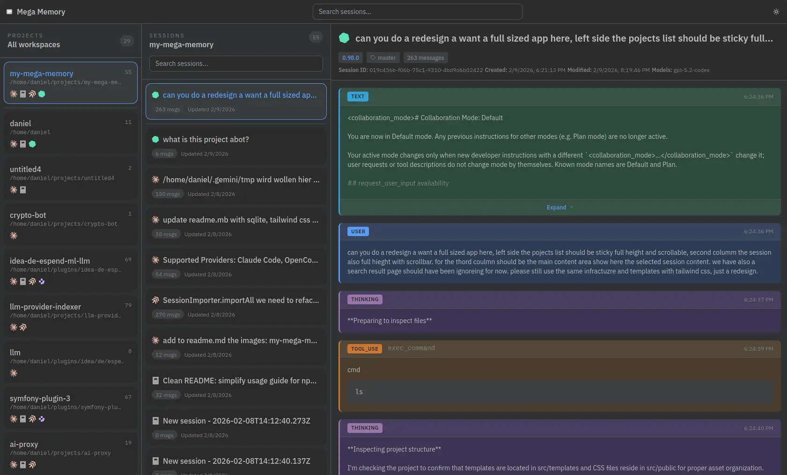
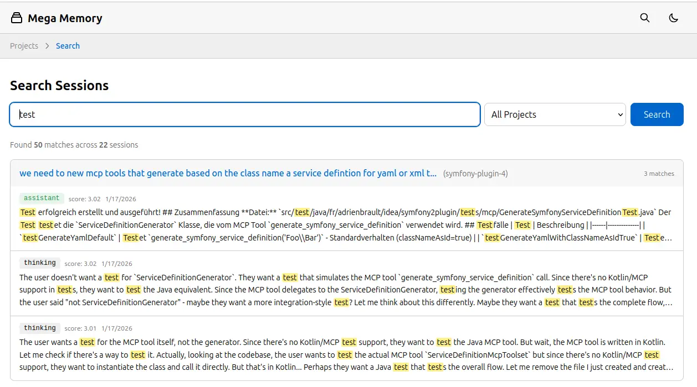

# My Mega Memory

AI Chat Session Importer and Viewer

Import your AI chat sessions into a local database, then browse and search them through a web interface.

**Supported Providers:** Claude Code, OpenCode, Codex, Amp, and Junie

## Quick Start

```bash
# Install dependencies
npm install

# Import your chat sessions
npm run import

# Start the web viewer
npm run dev
```

### npx

```
npx my-mega-memory import
npx my-mega-memory serve
```

Then open http://localhost:3000 to browse your sessions.

## Create Database

Create fresh databases, dropping all existing data if present:

```bash
# npm
npm run create-database

# npx
npx my-mega-memory create-database
```

## Remote Push

You can push sessions from any machine to a running Mega Memory server via API, instead of importing locally.

```bash
# npm
npm run push -- --url http://your-server:3000

# npx
npx my-mega-memory push --url http://your-server:3000
```

This scans all providers locally and sends each session to the server's `POST /api/import/session` endpoint. The `--url` flag defaults to `http://localhost:3000`.

### API

| Method | Endpoint | Description |
|--------|----------|-------------|
| `POST` | `/api/import/session` | Import a single session. Expects a JSON body with `session`, `provider`, `projectPath`, `projectName`, `created`, and `updated` fields. |

## Screenshots


